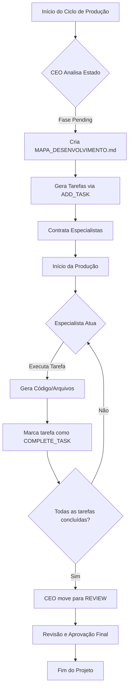

# Plano de Execução: Sistema de Tarefas Granulares

Este documento detalha o plano para a implementação de um sistema de tarefas dentro d'A Fábrica, permitindo um controle mais fino sobre a produção de software.

## 1. Visão Geral
O sistema de tarefas permite que o CEO e os especialistas quebrem o projeto em unidades menores de trabalho. Isso melhora a rastreabilidade e permite que a "Diretoria" (usuário) acompanhe o progresso em tempo real.

## 2. Arquitetura do Sistema de Tarefas

### Banco de Dados
- **Tabela `tasks`**: Armazena o título, descrição, status e a quem a tarefa está atribuída.

### Comandos de Agentes
Os agentes podem interagir com o sistema usando as seguintes tags:
- `[ADD_TASK: Título | Descrição]`: Cria uma nova tarefa.
- `[COMPLETE_TASK: ID ou Título]`: Marca uma tarefa como finalizada.

## 3. Diagrama de Fluxo (Mermaid)

## 4. Próximos Passos
1. **Interface UI**: Adicionar uma aba de "Tarefas" no frontend para visualizar o progresso.
2. **Atribuição Automática**: Melhorar a lógica para que o CEO possa atribuir tarefas diretamente a um especialista específico via ID.
3. **Notificações**: Enviar e-mails (logs) quando uma tarefa crítica for concluída.

---
*Gerado por A Fábrica - Assistente de Codificação*
